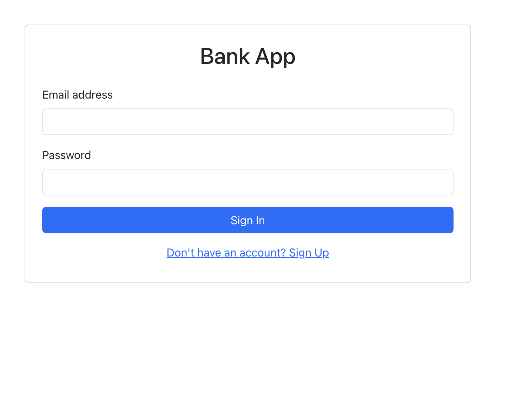

# Bank Service App Frontend
This is a frontend application for the Bank Service App. It is built using ReactJS and supabase for authentication.

## Features
Fully functional banking application with the following features:
- Multi user account creation.
- Deposit and withdrawl with persistant data.
- User authentication with email and password.
- Account balance and summary.
- Responsive design.
- Full user history persisted using CQRS event-sourcing backend architecture, user can retrieve their transaction history since inception should compilance require it.

## Tech Stact
- ReactJS
- Supabase
- Bootstrap
- Axios
- React Router

